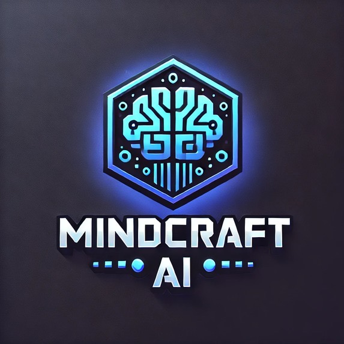

# 🧠 MindCraft AI Quiz Game

**🚀 A fun and fast-paced AI-powered quiz game!**  

MindCraft AI Quiz Game is an engaging, timed quiz where players test their knowledge, think quickly, and earn points for correct answers. The game is designed to make learning fun and challenging while ensuring a fresh experience with dynamically generated questions.

---

## **🕹️ How It Works**
- Players have **135 seconds** to answer **25 AI-generated questions**.
- Each correct answer earns points.
- AI dynamically generates new questions to ensure variety.

🔗 **Try the game here:** [MindCraft AI Quiz Game](https://breshna.io/api/games/choiceChamp/index.html?template_id=6794b9d7b50f5ce7e659641b)

---

## **🛠️ How We Built It**
This project was developed using **no-code development platforms**, allowing us to rapidly prototype and build an interactive experience without traditional coding. 

During development, we focused on:
✅ Designing a **real-time quiz system** with score tracking.  
✅ Implementing a **135-second timer** for added challenge.  
✅ Enhancing user experience with **smooth question transitions**.  

🔗 **Project submission on Devpost:** [MindCraft on Devpost](https://devpost.com/software/mindcraft-hkq0l8)

---

## **🚧 Challenges We Faced**
- Optimizing AI-generated questions for **accuracy and variety**.

---

## **🔮 Future Plans**
🔹 **Leaderboards** to track top players.  
🔹 **Power-ups** for extra time or hints.  
🔹 **Enhanced AI model** for personalized question difficulty.  

---

## **📜 License**
This project is part of a hackathon submission and is shared for educational and experimental purposes.

📧 **Contact:** If you have any questions or feedback, feel free to reach out!

---

🎥 **Demo Video:** *(Attached in the repository)*

[Screenshot](ss.png)
